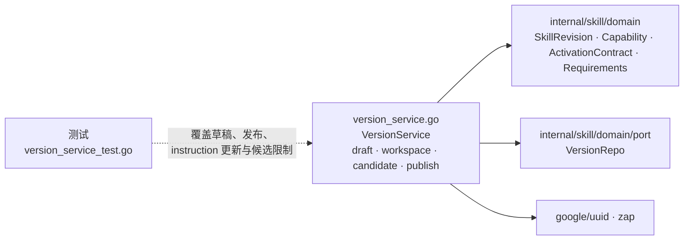

# internal/skill/application

该包编排版本化 instruction Skill 的草稿、工作区、候选版本、发布与删除用例。

完整导入路径：`github.com/byteBuilderX/stratum/internal/skill/application`

`VersionService` 创建 UUID v7 skill/revision，计算内容哈希，并只允许候选版本改写 `instructions`。发布前由领域模型校验 capability、已确认 activation contract、instructions 与依赖要求；该包不再包含旧的直接执行用例。
