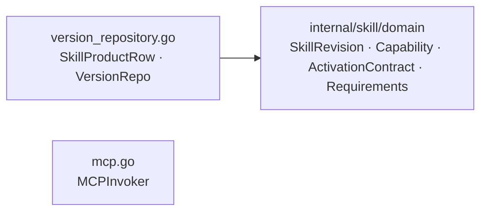

# internal/skill/domain/port

该包声明 Skill 应用层需要的版本仓储和 MCP 调用契约。

完整导入路径：`github.com/byteBuilderX/stratum/internal/skill/domain/port`

`VersionRepo` 覆盖 skill 与 revision 的创建、读取、草稿字段更新、候选插入和发布事务；`MCPInvoker` 是按 server/tool 调用 MCP 的最小同步契约。旧 analyzer、executor、factory、HTTP 和 LLM 执行端口已不在当前包中。
