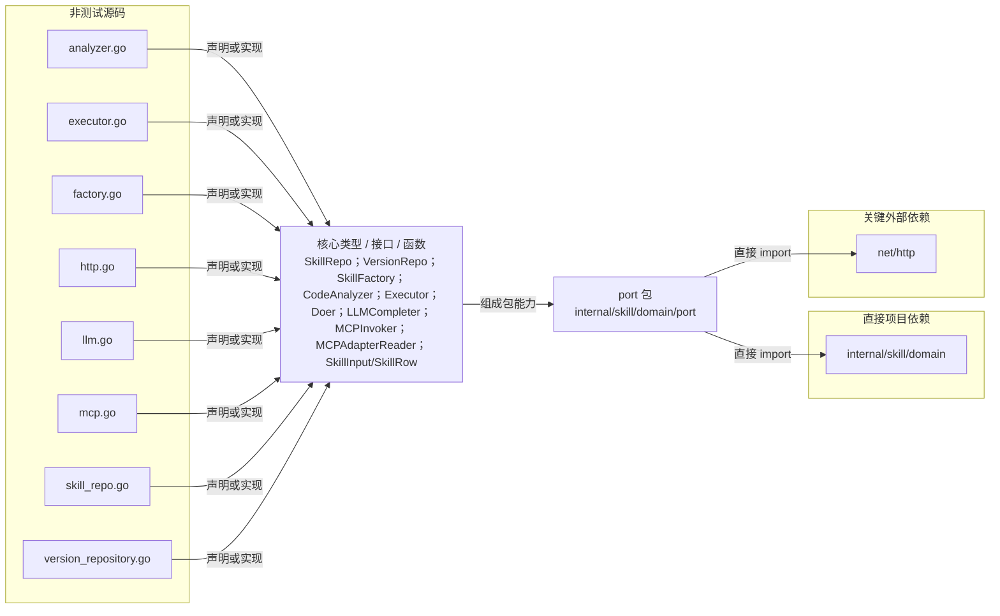

# internal/skill/domain/port

定义 Skill 应用层所需的持久化、构造、分析、HTTP、LLM、MCP 与执行器出向契约及传输结构。

- 完整导入路径：`github.com/byteBuilderX/stratum/internal/skill/domain/port`

图中每个源码节点均对应 `go list -json` 返回的非测试 Go 文件；核心节点概括这些文件共同暴露或实现的主要架构表面。 项目内箭头仅表示当前包的直接 import，包含：`internal/skill/domain`。 关键外部依赖为：`net/http`。
