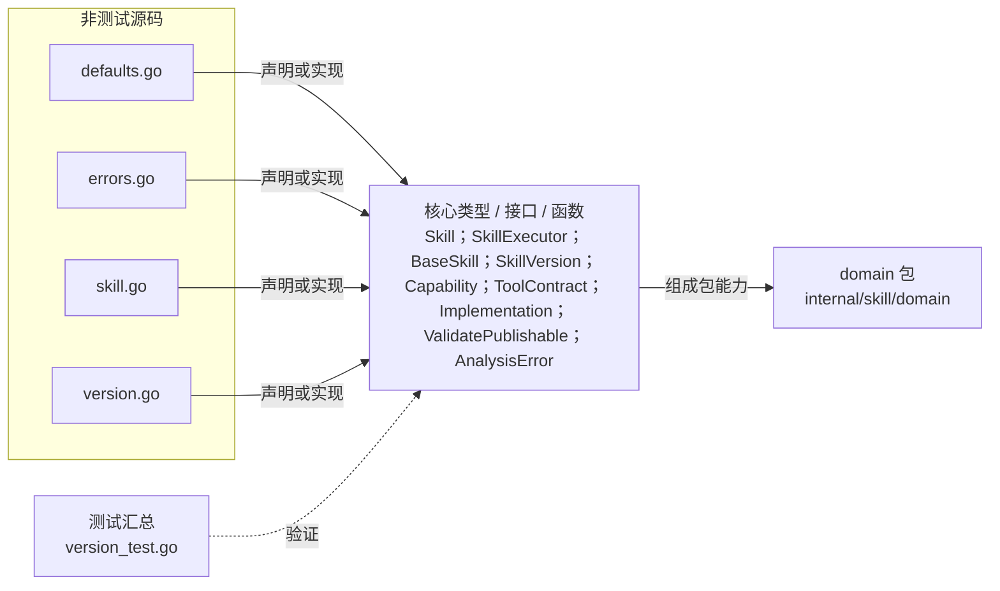

# internal/skill/domain

定义 Skill 聚合、可执行契约、版本能力/工具契约/实现配置、发布校验与领域错误。

- 完整导入路径：`github.com/byteBuilderX/stratum/internal/skill/domain`

图中每个源码节点均对应 `go list -json` 返回的非测试 Go 文件；核心节点概括这些文件共同暴露或实现的主要架构表面。 当前包没有直接导入其他 stratum 项目包。 测试文件合并为一个节点：`version_test.go`。
