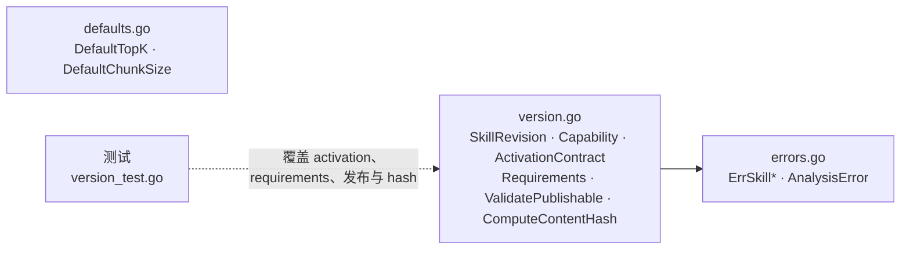

# internal/skill/domain

该包定义版本化 instruction Skill 的领域模型、发布校验、内容哈希、默认值与领域错误。

完整导入路径：`github.com/byteBuilderX/stratum/internal/skill/domain`

发布版本要求非空 capability goal/when-to-use、至少一个示例、已确认且 schema 合法的 activation contract、非空 instructions，以及格式正确且去重的 MCP tool、知识工作区和 memory scope 要求。内容哈希覆盖这些可执行 instruction 字段。
