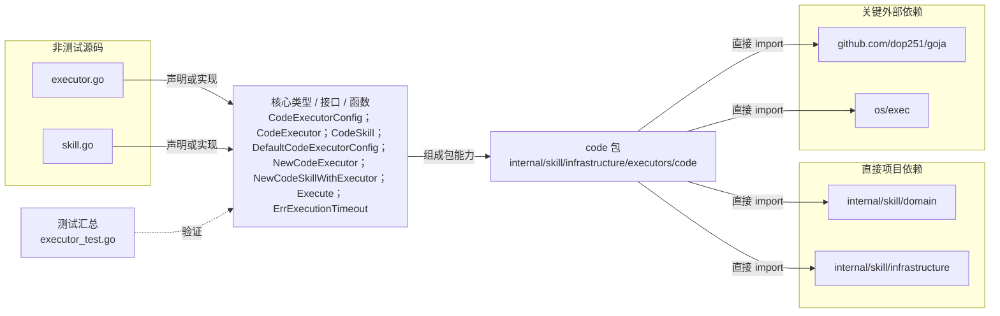

# internal/skill/infrastructure/executors/code

实现 Python 子进程与 goja JavaScript VM 的受限代码执行，并将执行器封装为 CodeSkill。

- 完整导入路径：`github.com/byteBuilderX/stratum/internal/skill/infrastructure/executors/code`

图中每个源码节点均对应 `go list -json` 返回的非测试 Go 文件；核心节点概括这些文件共同暴露或实现的主要架构表面。 项目内箭头仅表示当前包的直接 import，包含：`internal/skill/domain`、`internal/skill/infrastructure`。 关键外部依赖为：`github.com/dop251/goja`、`os/exec`。 测试文件合并为一个节点：`executor_test.go`。
