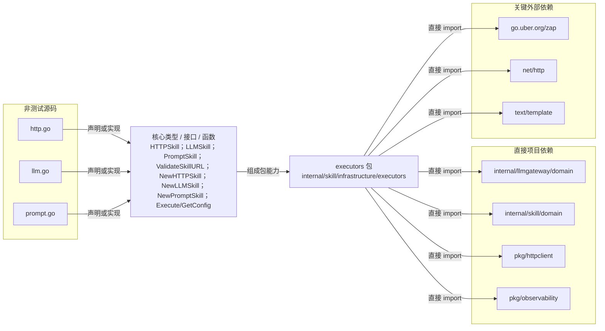

# internal/skill/infrastructure/executors

实现 HTTP、LLM 与提示词三类可执行 Skill；HTTP 路径使用 SSRF 安全客户端，LLM 路径调用统一网关契约。

- 完整导入路径：`github.com/byteBuilderX/stratum/internal/skill/infrastructure/executors`

图中每个源码节点均对应 `go list -json` 返回的非测试 Go 文件；核心节点概括这些文件共同暴露或实现的主要架构表面。 项目内箭头仅表示当前包的直接 import，包含：`internal/llmgateway/domain`、`internal/skill/domain`、`pkg/httpclient`、`pkg/observability`。 关键外部依赖为：`go.uber.org/zap`、`net/http`、`text/template`。
