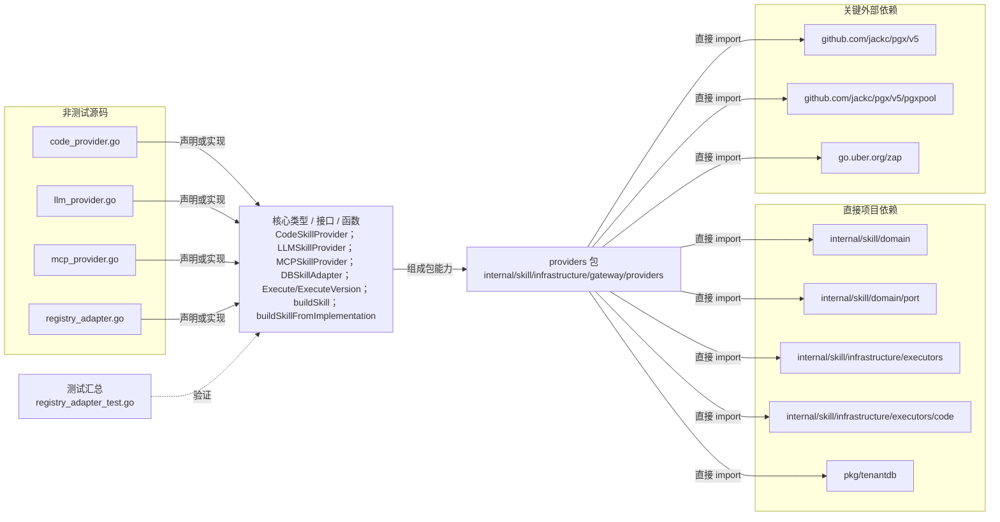

# internal/skill/infrastructure/gateway/providers

把代码、LLM、MCP 与数据库动态 Skill 适配为 gateway.SkillProvider，并支持按冻结版本构建执行器。

- 完整导入路径：`github.com/byteBuilderX/stratum/internal/skill/infrastructure/gateway/providers`

图中每个源码节点均对应 `go list -json` 返回的非测试 Go 文件；核心节点概括这些文件共同暴露或实现的主要架构表面。 项目内箭头仅表示当前包的直接 import，包含：`internal/skill/domain`、`internal/skill/domain/port`、`internal/skill/infrastructure/executors`、`internal/skill/infrastructure/executors/code`、`pkg/tenantdb`。 关键外部依赖为：`github.com/jackc/pgx/v5`、`github.com/jackc/pgx/v5/pgxpool`、`go.uber.org/zap`。 测试文件合并为一个节点：`registry_adapter_test.go`。
