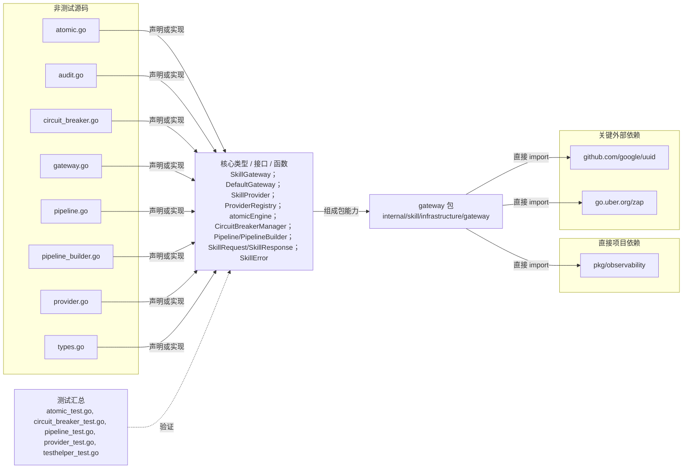

# internal/skill/infrastructure/gateway

提供统一 Skill 调用网关、Provider 注册路由、超时重试、熔断、审计指标以及顺序/条件/并行 Pipeline 编排。

- 完整导入路径：`github.com/byteBuilderX/stratum/internal/skill/infrastructure/gateway`

图中每个源码节点均对应 `go list -json` 返回的非测试 Go 文件；核心节点概括这些文件共同暴露或实现的主要架构表面。 项目内箭头仅表示当前包的直接 import，包含：`pkg/observability`。 关键外部依赖为：`github.com/google/uuid`、`go.uber.org/zap`。 测试文件合并为一个节点：`atomic_test.go`、`circuit_breaker_test.go`、`pipeline_test.go`、`provider_test.go`、`testhelper_test.go`。
