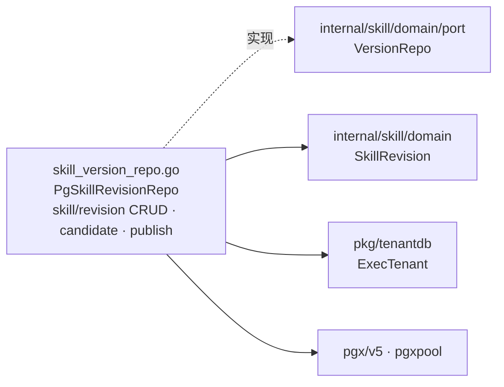

# internal/skill/infrastructure/persistence

该包以 tenant PostgreSQL 事务实现版本化 Skill 仓储。

完整导入路径：`github.com/byteBuilderX/stratum/internal/skill/infrastructure/persistence`

`PgSkillRevisionRepo` 对 capability、activation contract、requirements、generation metadata 和 publish checks 做显式 JSON 编解码。发布在单个 tenant 事务中弃用旧 published revision、发布 draft，并更新 `skills.active_revision_id`。
