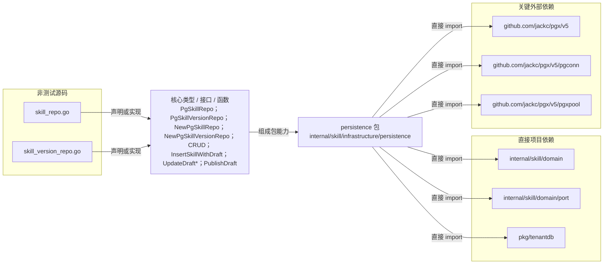

# internal/skill/infrastructure/persistence

使用 PostgreSQL 租户事务实现 SkillRepo 与 VersionRepo，负责 JSONB 编解码、领域错误翻译和草稿发布事务。

- 完整导入路径：`github.com/byteBuilderX/stratum/internal/skill/infrastructure/persistence`

图中每个源码节点均对应 `go list -json` 返回的非测试 Go 文件；核心节点概括这些文件共同暴露或实现的主要架构表面。 项目内箭头仅表示当前包的直接 import，包含：`internal/skill/domain`、`internal/skill/domain/port`、`pkg/tenantdb`。 关键外部依赖为：`github.com/jackc/pgx/v5`、`github.com/jackc/pgx/v5/pgconn`、`github.com/jackc/pgx/v5/pgxpool`。
