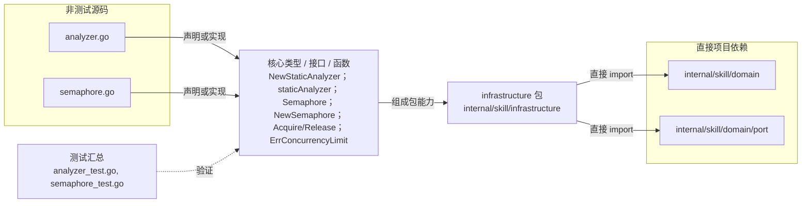

# internal/skill/infrastructure

实现代码静态安全分析与全局/租户并发信号量，为代码执行器提供基础设施能力。

- 完整导入路径：`github.com/byteBuilderX/stratum/internal/skill/infrastructure`

图中每个源码节点均对应 `go list -json` 返回的非测试 Go 文件；核心节点概括这些文件共同暴露或实现的主要架构表面。 项目内箭头仅表示当前包的直接 import，包含：`internal/skill/domain`、`internal/skill/domain/port`。 测试文件合并为一个节点：`analyzer_test.go`、`semaphore_test.go`。
