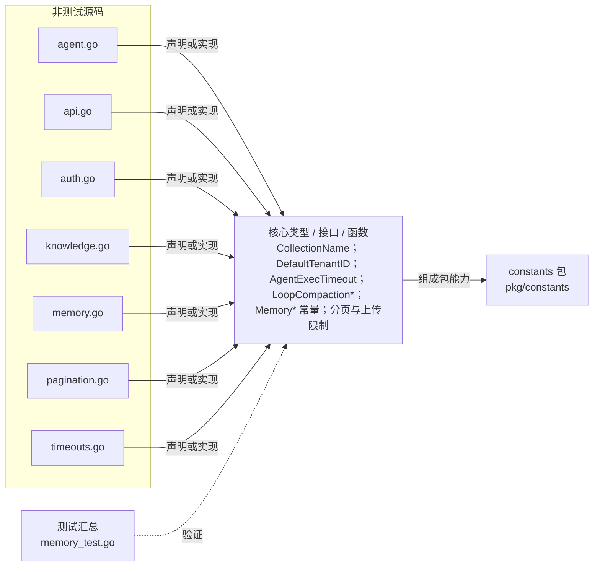

# pkg/constants

集中定义跨包共享的 Agent、API、认证、知识、记忆、分页与超时常量，并提供知识集合命名函数。

- 完整导入路径：`github.com/byteBuilderX/stratum/pkg/constants`

图中每个源码节点均对应 `go list -json` 返回的非测试 Go 文件；核心节点概括这些文件共同暴露或实现的主要架构表面。 当前包没有直接导入其他 stratum 项目包。 测试文件合并为一个节点：`memory_test.go`。
