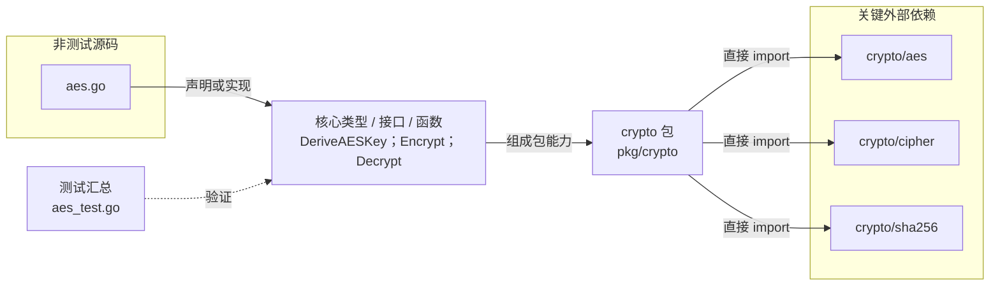

# pkg/crypto

提供基于 SHA-256 派生密钥的 AES-256-GCM 字符串加解密。

- 完整导入路径：`github.com/byteBuilderX/stratum/pkg/crypto`

图中每个源码节点均对应 `go list -json` 返回的非测试 Go 文件；核心节点概括这些文件共同暴露或实现的主要架构表面。 当前包没有直接导入其他 stratum 项目包。 关键外部依赖为：`crypto/aes`、`crypto/cipher`、`crypto/sha256`。 测试文件合并为一个节点：`aes_test.go`。
