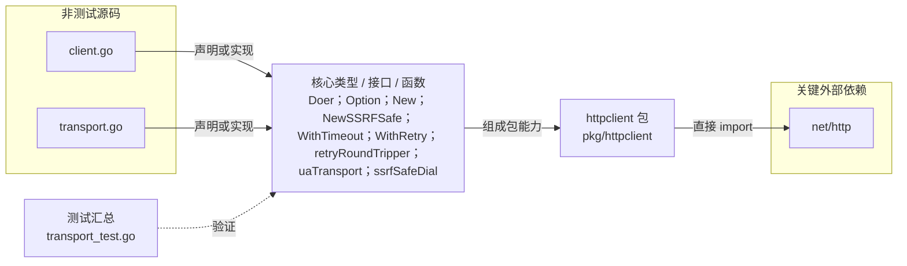

# pkg/httpclient

构造统一超时、User-Agent、重试与 SSRF 防护的 HTTP 客户端和 Transport。

- 完整导入路径：`github.com/byteBuilderX/stratum/pkg/httpclient`

图中每个源码节点均对应 `go list -json` 返回的非测试 Go 文件；核心节点概括这些文件共同暴露或实现的主要架构表面。 当前包没有直接导入其他 stratum 项目包。 关键外部依赖为：`net/http`。 测试文件合并为一个节点：`transport_test.go`。
