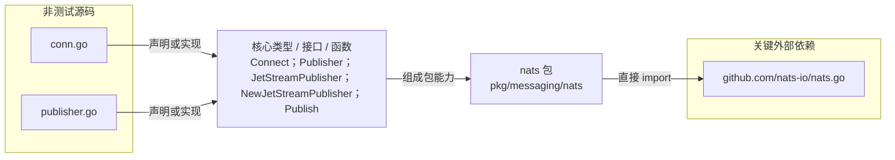

# pkg/messaging/nats

封装 NATS 连接和带退避重试的消息发布。

- 完整导入路径：`github.com/byteBuilderX/stratum/pkg/messaging/nats`

`conn.go` 建立 NATS 连接；`publisher.go` 定义 `Publisher` 接口，并由 `JetStreamPublisher` 实现，构造入口为 `NewJetStreamPublisher`，发布失败时执行有限指数退避。当前包没有直接导入其他 stratum 项目包。关键外部依赖为：`github.com/nats-io/nats.go`。
