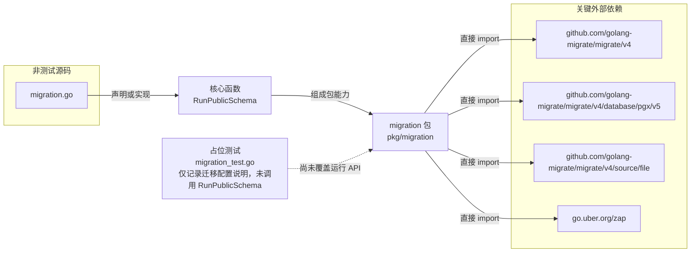

# pkg/migration

封装 golang-migrate 的 public schema PostgreSQL 文件迁移执行，包括 dirty version 修复与增量升级。

- 完整导入路径：`github.com/byteBuilderX/stratum/pkg/migration`

`migration.go` 仅公开 `RunPublicSchema`：它创建 migrate 实例、检查并修复 dirty version、执行 `Up`，再通过传入的 Zap logger 记录完成状态；包内没有额外的 logger 类型。当前包没有直接导入其他 stratum 项目包。关键外部依赖为：`github.com/golang-migrate/migrate/v4`、`github.com/golang-migrate/migrate/v4/database/pgx/v5`、`github.com/golang-migrate/migrate/v4/source/file`、`go.uber.org/zap`。`migration_test.go` 是占位测试，只输出配置说明，未验证 `RunPublicSchema`。
