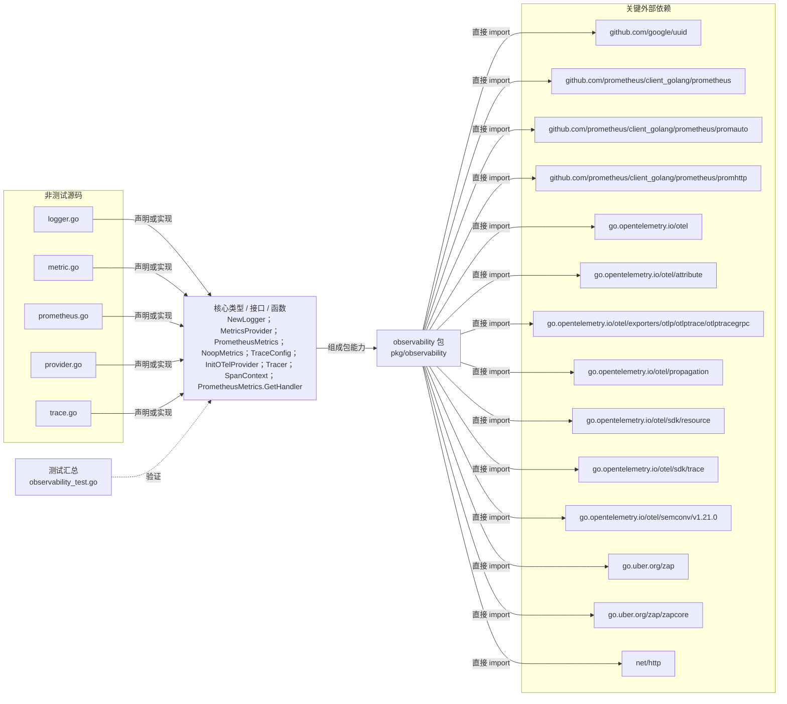

# pkg/observability

提供 Zap 日志、Prometheus 指标和 OpenTelemetry trace provider、span 上下文与 HTTP handler。

- 完整导入路径：`github.com/byteBuilderX/stratum/pkg/observability`

图中每个源码节点均对应 `go list -json` 返回的非测试 Go 文件；Prometheus HTTP handler 由 `(*PrometheusMetrics).GetHandler` 返回，日志、指标与追踪能力分别由其余核心类型组织。当前包没有直接导入其他 stratum 项目包。关键外部依赖为：`github.com/google/uuid`、`github.com/prometheus/client_golang/prometheus`、`github.com/prometheus/client_golang/prometheus/promauto`、`github.com/prometheus/client_golang/prometheus/promhttp`、`go.opentelemetry.io/otel`、`go.opentelemetry.io/otel/attribute`、`go.opentelemetry.io/otel/exporters/otlp/otlptrace/otlptracegrpc`、`go.opentelemetry.io/otel/propagation`、`go.opentelemetry.io/otel/sdk/resource`、`go.opentelemetry.io/otel/sdk/trace`、`go.opentelemetry.io/otel/semconv/v1.21.0`、`go.uber.org/zap`、`go.uber.org/zap/zapcore`、`net/http`。测试文件合并为一个节点：`observability_test.go`。
