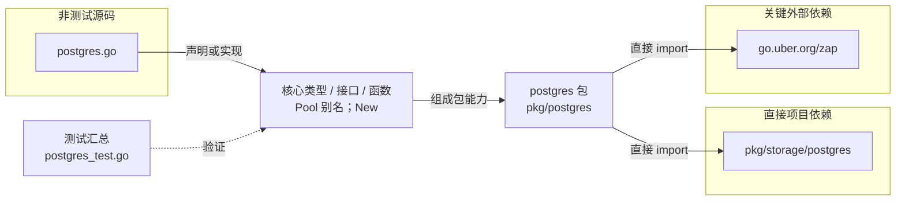

# pkg/postgres

为已迁移的 storage/postgres 包保留向后兼容构造入口。

- 完整导入路径：`github.com/byteBuilderX/stratum/pkg/postgres`

图中每个源码节点均对应 `go list -json` 返回的非测试 Go 文件；核心节点概括这些文件共同暴露或实现的主要架构表面。 项目内箭头仅表示当前包的直接 import，包含：`pkg/storage/postgres`。 关键外部依赖为：`go.uber.org/zap`。 测试文件合并为一个节点：`postgres_test.go`。
