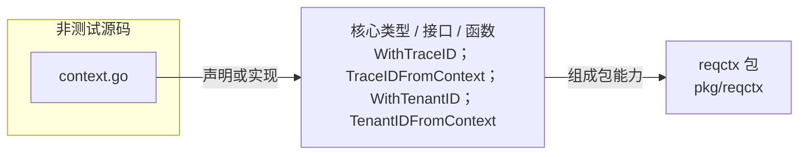

# pkg/reqctx

用 context 传播 trace ID 与 tenant ID，并提供对应的安全读取函数。

- 完整导入路径：`github.com/byteBuilderX/stratum/pkg/reqctx`

图中 `context.go` 定义两组 context 写入与读取函数：`WithTraceID` / `TraceIDFromContext` 和 `WithTenantID` / `TenantIDFromContext`。当前包没有直接导入其他 stratum 项目包。
