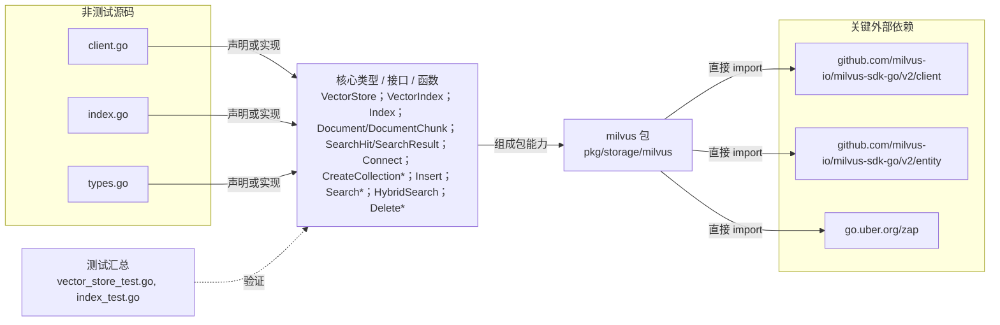

# pkg/storage/milvus

封装 Milvus 连接、集合/分区管理、向量写入、过滤搜索、关键词与混合检索，并提供通用 VectorIndex 适配器。

- 完整导入路径：`github.com/byteBuilderX/stratum/pkg/storage/milvus`

图中每个源码节点均对应 `go list -json` 返回的非测试 Go 文件；核心节点概括这些文件共同暴露或实现的主要架构表面。 当前包没有直接导入其他 stratum 项目包。 关键外部依赖为：`github.com/milvus-io/milvus-sdk-go/v2/client`、`github.com/milvus-io/milvus-sdk-go/v2/entity`、`go.uber.org/zap`。 测试文件合并为一个节点：`vector_store_test.go`、`index_test.go`。
