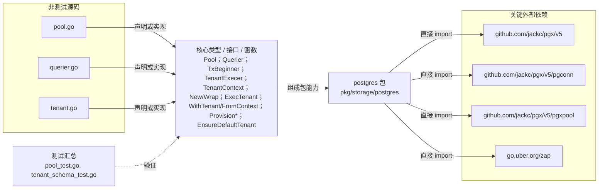

# pkg/storage/postgres

封装 pgx 连接池、最小查询接口、租户上下文与 search_path 事务，并执行 public/tenant schema 幂等 provisioning。

- 完整导入路径：`github.com/byteBuilderX/stratum/pkg/storage/postgres`

图中每个源码节点均对应 `go list -json` 返回的非测试 Go 文件；核心节点概括这些文件共同暴露或实现的主要架构表面。 当前包没有直接导入其他 stratum 项目包。 关键外部依赖为：`github.com/jackc/pgx/v5`、`github.com/jackc/pgx/v5/pgconn`、`github.com/jackc/pgx/v5/pgxpool`、`go.uber.org/zap`。 测试文件合并为一个节点：`pool_test.go`、`tenant_schema_test.go`。
