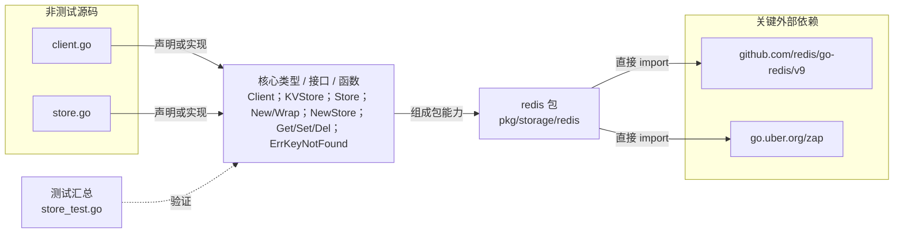

# pkg/storage/redis

封装 go-redis 客户端及最小 KVStore 接口，统一 key-not-found 语义。

- 完整导入路径：`github.com/byteBuilderX/stratum/pkg/storage/redis`

图中每个源码节点均对应 `go list -json` 返回的非测试 Go 文件；核心节点概括这些文件共同暴露或实现的主要架构表面。 当前包没有直接导入其他 stratum 项目包。 关键外部依赖为：`github.com/redis/go-redis/v9`、`go.uber.org/zap`。 测试文件合并为一个节点：`store_test.go`。
