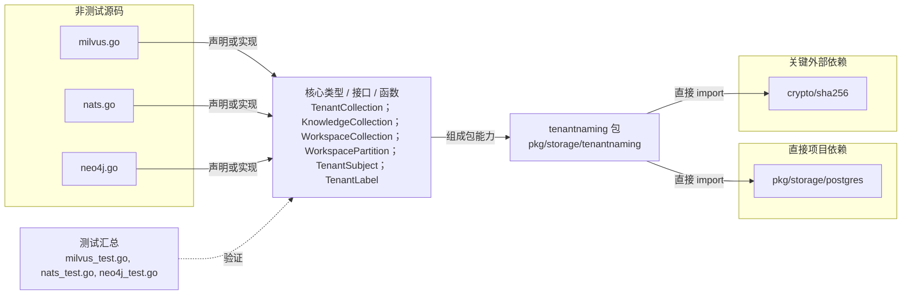

# pkg/storage/tenantnaming

提供无数据库 IO 的租户级 Milvus collection/partition、NATS subject 与 Neo4j label 命名 DSL。

- 完整导入路径：`github.com/byteBuilderX/stratum/pkg/storage/tenantnaming`

图中每个源码节点均对应 `go list -json` 返回的非测试 Go 文件；核心节点概括这些文件共同暴露或实现的主要架构表面。 项目内箭头仅表示当前包的直接 import，包含：`pkg/storage/postgres`。 关键外部依赖为：`crypto/sha256`。 测试文件合并为一个节点：`milvus_test.go`、`nats_test.go`、`neo4j_test.go`。
