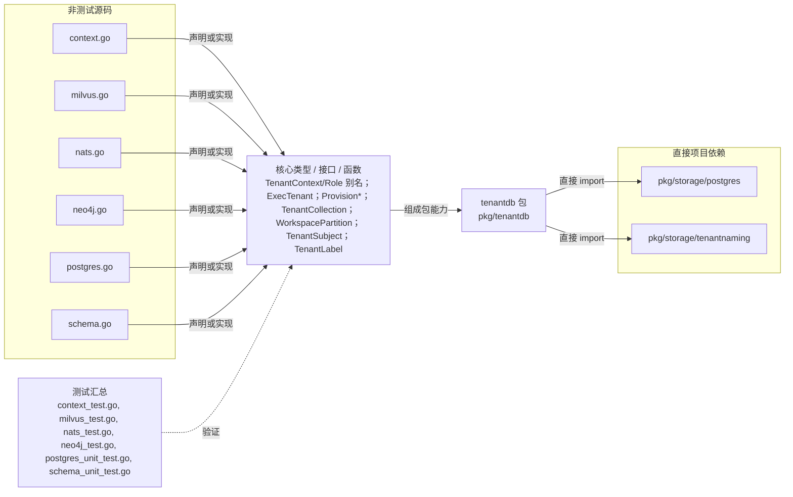

# pkg/tenantdb

向后兼容地重导出 storage/postgres 的租户上下文/事务/schema API 与 storage/tenantnaming 的命名 API。

- 完整导入路径：`github.com/byteBuilderX/stratum/pkg/tenantdb`

图中每个源码节点均对应 `go list -json` 返回的非测试 Go 文件；核心节点概括这些文件共同暴露或实现的主要架构表面。 项目内箭头仅表示当前包的直接 import，包含：`pkg/storage/postgres`、`pkg/storage/tenantnaming`。 测试文件合并为一个节点：`context_test.go`、`milvus_test.go`、`nats_test.go`、`neo4j_test.go`、`postgres_unit_test.go`、`schema_unit_test.go`。
