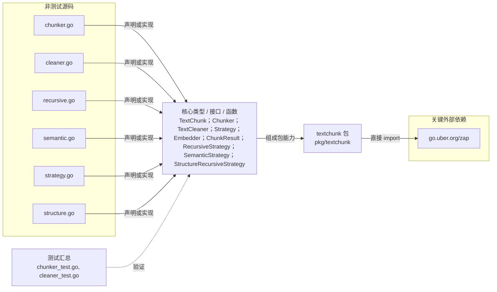

# pkg/textchunk

提供文本清洗、去重和递归、语义、结构化切块策略，以及旧版 Chunker API。

- 完整导入路径：`github.com/byteBuilderX/stratum/pkg/textchunk`

图中每个源码节点均对应 `go list -json` 返回的非测试 Go 文件；核心节点概括这些文件共同暴露或实现的主要架构表面。 当前包没有直接导入其他 stratum 项目包。 关键外部依赖为：`go.uber.org/zap`。 测试文件合并为一个节点：`chunker_test.go`、`cleaner_test.go`。
