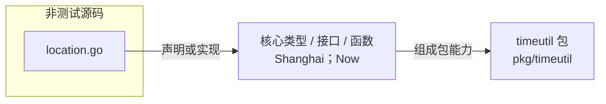

# pkg/timeutil

统一提供 Asia/Shanghai 时区位置与当前时间。

- 完整导入路径：`github.com/byteBuilderX/stratum/pkg/timeutil`

```mermaid
flowchart LR
  pkg["timeutil 包<br/>pkg/timeutil"]
  api["核心类型 / 接口 / 函数<br/>Shanghai；Now"]
  subgraph source[非测试源码]
    f0["location.go"]
  end
  f0 -->|声明或实现| api
  api -->|组成包能力| pkg
```

图中每个源码节点均对应 `go list -json` 返回的非测试 Go 文件；核心节点概括这些文件共同暴露或实现的主要架构表面。 当前包没有直接导入其他 stratum 项目包。
