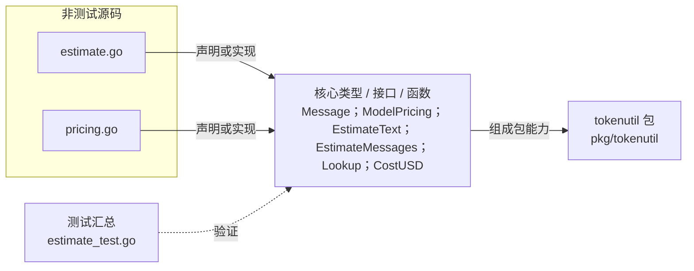

# pkg/tokenutil

提供轻量 token 数估算、静态模型定价查询与美元成本计算。

- 完整导入路径：`github.com/byteBuilderX/stratum/pkg/tokenutil`

图中每个源码节点均对应 `go list -json` 返回的非测试 Go 文件；核心节点概括这些文件共同暴露或实现的主要架构表面。 当前包没有直接导入其他 stratum 项目包。 测试文件合并为一个节点：`estimate_test.go`。
