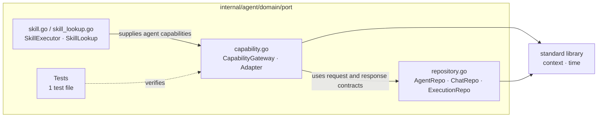

# Go Package Architecture Diagrams Implementation Plan

> **For agentic workers:** REQUIRED SUB-SKILL: Use superpowers:subagent-driven-development (recommended) or superpowers:executing-plans to implement this plan task-by-task. Steps use checkbox (`- [ ]`) syntax for tracking.

**Goal:** Generate an indexed Mermaid architecture document for each of the 63 Go packages currently returned by `go list ./internal/... ./pkg/...`.

**Architecture:** Treat `go list -json` and checked-in Go source as the source of truth. Produce one Markdown document per package under `docs/go-package-architecture/`, with one readable Mermaid flowchart showing files, important declarations, relationships, and direct dependencies; produce a categorized `README.md` linking every package document.

**Tech Stack:** Go toolchain (`go list`, `go doc`), shell inspection, Mermaid flowchart syntax, Markdown.

---

## Task 1: Freeze the target package manifest

**Files:**

- Create: `docs/go-package-architecture/package-manifest.txt`

- [ ] **Step 1: Capture the canonical package list**

```bash
mkdir -p docs/go-package-architecture
go list ./internal/... ./pkg/... | sed 's#github.com/byteBuilderX/stratum/##' > docs/go-package-architecture/package-manifest.txt
```

Expected: 63 sorted paths, from `internal/agent/application` through `pkg/vector`.

- [ ] **Step 2: Verify scope exclusions**

```bash
test "$(wc -l < docs/go-package-architecture/package-manifest.txt)" -eq 63
! grep -Eq '^(api|cmd|config|web|tmp|vendor|\.worktrees)/' docs/go-package-architecture/package-manifest.txt
```

Expected: both commands exit 0.

## Task 2: Analyze every target package

**Files:**

- Read: every non-test `.go` file in each manifest package
- Read: test file names reported by `go list -json`
- Read: `docs/agent/architecture.md`
- Read: relevant module rules in `docs/agent/agent.md`, `docs/agent/milvus.md`, `docs/agent/nats.md`, and `docs/agent/observability.md`

- [ ] **Step 1: Export authoritative metadata**

```bash
go list -json ./internal/... ./pkg/... > /tmp/stratum-go-package-metadata.json
```

Expected: exit 0 and non-empty output.

- [ ] **Step 2: Read complete source package by package**

For every manifest entry, read all `.GoFiles` and `.CgoFiles` and record this evidence:

```text
package responsibility
non-test source files
exported structs, interfaces, and functions
important unexported implementation types
constructors and interface implementations
direct stratum imports
architecturally significant external imports
test file count
```

Expected: every package has evidence-backed notes before its diagram is written; declarations and relationships are not inferred solely from filenames.

## Task 3: Generate the 63 package documents

**Files:**

- Create: `docs/go-package-architecture/internal-*.md`
- Create: `docs/go-package-architecture/pkg-*.md`

The exact output path for package `P` is `docs/go-package-architecture/${P//\//-}.md`.

Examples:

```text
internal/agent/application  -> docs/go-package-architecture/internal-agent-application.md
internal/memory/domain/port -> docs/go-package-architecture/internal-memory-domain-port.md
pkg/storage/postgres        -> docs/go-package-architecture/pkg-storage-postgres.md
```

- [ ] **Step 1: Write one document per manifest entry**

Use this concrete `internal/agent/domain/port` example as the structural pattern. For every other package, substitute only declarations, files, imports, and descriptions verified from that package's source:

````markdown
# `internal/agent/domain/port`

完整导入路径：`github.com/byteBuilderX/stratum/internal/agent/domain/port`

该包定义 Agent 应用层消费的出向端口，由基础设施适配器实现。



## 说明

- **核心文件：** `capability.go` 定义统一能力网关；`repository.go` 定义持久化端口；`skill.go` 与 `skill_lookup.go` 定义 Skill 执行和查询端口。
- **内部依赖：** 无。
- **外部依赖：** 仅标准库。
````

Rules:

```text
exactly one Mermaid block per package document
group nodes by file or cohesive responsibility
include all non-test Go files, merging only when readability requires it
include core declarations, not every method
include only source-proven relationships
escape Mermaid-reserved punctuation in labels
summarize tests in one node without enumerating test functions
```

Expected: 63 package Markdown files, each containing one Mermaid fence.

## Task 4: Generate the categorized index

**Files:**

- Create: `docs/go-package-architecture/README.md`

- [ ] **Step 1: Write index conventions**

```markdown
# Stratum Go 包代码架构图

本目录覆盖 `go list ./internal/... ./pkg/...` 返回的全部 Go 包。每个包对应一个独立 Mermaid 架构图；图中关系以当前源码为准。

- 生成范围：`internal/...`、`pkg/...`
- 包总数：63
- 不包含：`api/`、`cmd/`、`config/`、前端及工作树副本
```

- [ ] **Step 2: Add every link once**

Group links under `internal/agent`, `internal/iam`, `internal/knowledge`, `internal/llmgateway`, `internal/mcp`, `internal/memory`, `internal/platform`, `internal/skill`, and `pkg`.

Each entry uses the verified package path, generated filename, and source-backed responsibility. Example:

```markdown
- [`internal/agent/application`](internal-agent-application.md) — 编排 Agent 创建、执行、会话存储和上下文预算。
```

Expected: all 63 entries appear exactly once and every link resolves.

## Task 5: Validate coverage, links, and Mermaid structure

**Files:**

- Verify: `docs/go-package-architecture/README.md`
- Verify: `docs/go-package-architecture/package-manifest.txt`
- Verify: `docs/go-package-architecture/internal-*.md`
- Verify: `docs/go-package-architecture/pkg-*.md`

- [ ] **Step 1: Verify one file per package**

```bash
expected=$(wc -l < docs/go-package-architecture/package-manifest.txt)
actual=$(find docs/go-package-architecture -maxdepth 1 -type f \( -name 'internal-*.md' -o -name 'pkg-*.md' \) | wc -l)
test "$expected" -eq "$actual"
while IFS= read -r pkg; do test -f "docs/go-package-architecture/${pkg//\//-}.md" || exit 1; done < docs/go-package-architecture/package-manifest.txt
```

Expected: exit 0 with `expected=63` and `actual=63`.

- [ ] **Step 2: Verify document structure**

```bash
while IFS= read -r pkg; do
  file="docs/go-package-architecture/${pkg//\//-}.md"
  test "$(grep -c '^```mermaid$' "$file")" -eq 1 || exit 1
  test "$(grep -c '^```$' "$file")" -eq 1 || exit 1
done < docs/go-package-architecture/package-manifest.txt
```

Expected: every package document has one opening Mermaid fence and one closing fence.

- [ ] **Step 3: Verify index coverage**

```bash
while IFS= read -r pkg; do
  file="${pkg//\//-}.md"
  test "$(grep -Fc "[$pkg]($file)" docs/go-package-architecture/README.md)" -eq 1 || exit 1
done < docs/go-package-architecture/package-manifest.txt
```

Expected: every package appears exactly once.

- [ ] **Step 4: Check Mermaid rendering capability**

```bash
if command -v mmdc >/dev/null 2>&1; then
  echo "Mermaid CLI available; render extracted diagrams for syntax validation"
else
  echo "Mermaid CLI not installed; structural validation completed, render validation skipped"
fi
```

Expected on this machine: Mermaid CLI is absent. Record the skipped render check; do not install a global npm package without authorization.

- [ ] **Step 5: Check final diff boundary**

```bash
git diff --check -- docs/go-package-architecture docs/superpowers/plans/2026-07-15-go-package-architecture-diagrams.md
git status --short
```

Expected: this task changes only `docs/go-package-architecture/` and this plan, while pre-existing unrelated changes remain untouched.
