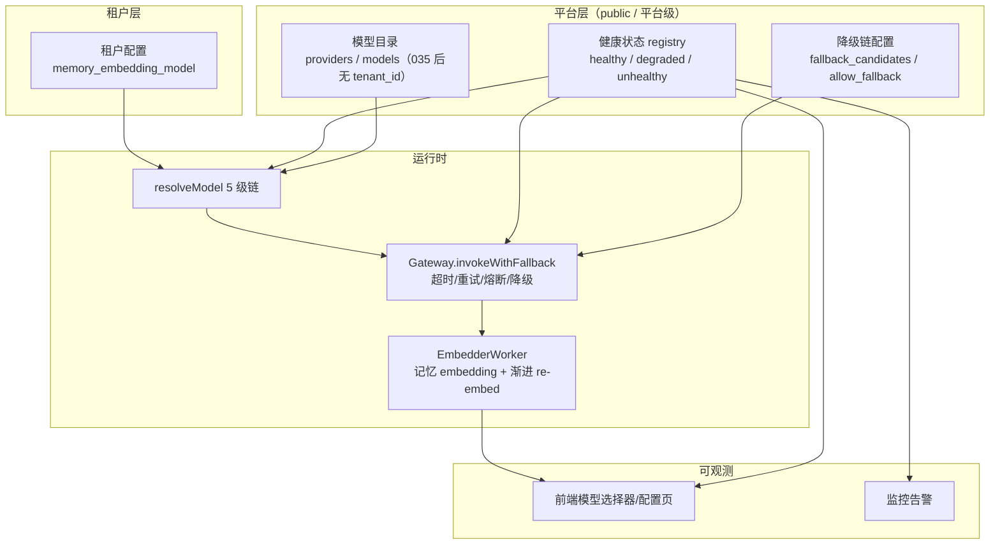
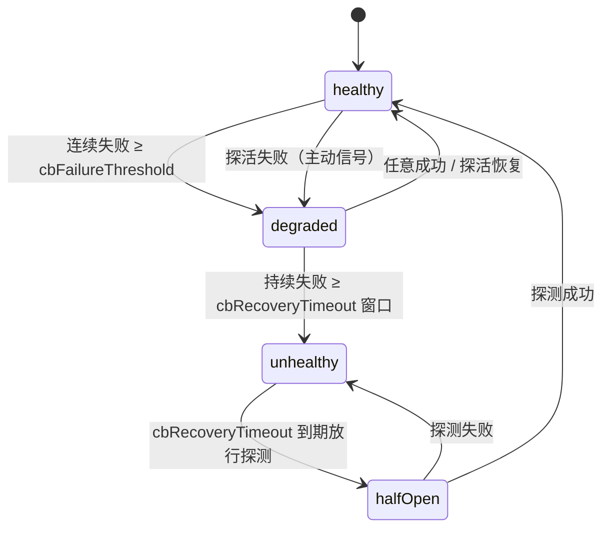
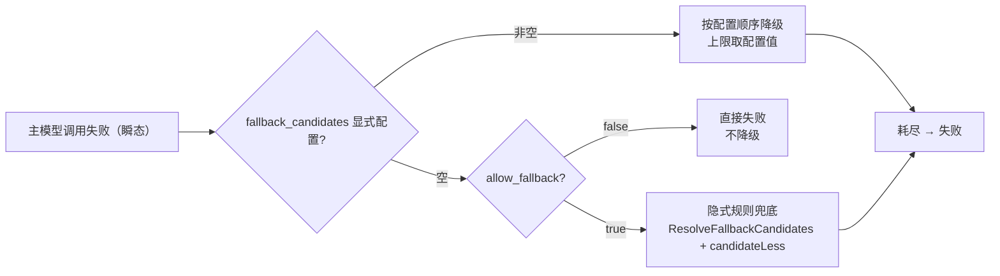
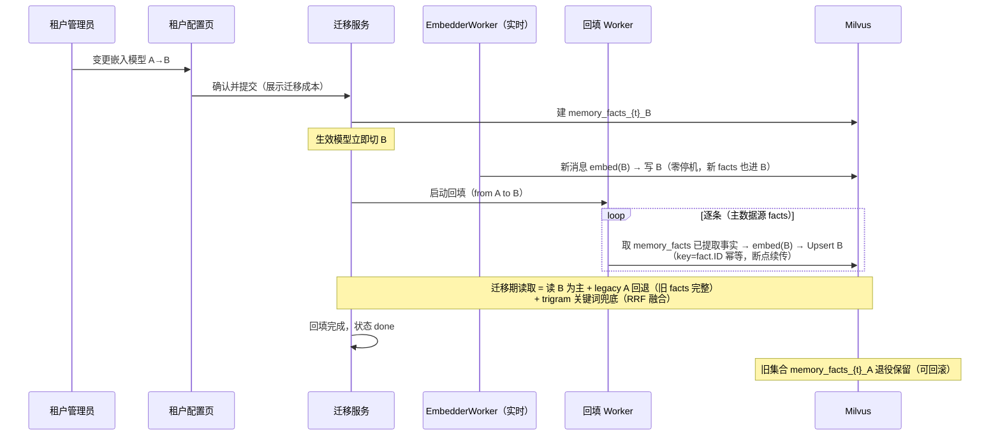

# 模型可用性感知 · 降级链 UI 化 · 记忆嵌入模型显式配置与平滑切换

日期：2026-08-20 · 状态：待复核 · 关联：`035_platform_model_catalog`、`2026-08-13-model-management-refactor-design.md`、`2026-08-11-embedding-profile-design.md`

## 1. 概述

本设计围绕 LLM 模型（chat + embedding）解决四个互相关联的问题：

1. **可用性零感知**：模型健康状态目前没有任何运行时感知，模型挂了没有页面提示、没有监控报警，只有调用方静默重试/降级。
2. **降级链不可控**：请求失败/超时的降级候选完全由代码硬编码规则自动挑选，管理员既看不到"主模型挂了之后请求发给谁"，也无法按主模型配置降级候选。
3. **记忆嵌入模型无租户显式配置**：嵌入模型解析走平台全局 `default_embedding` 标记（035 后全表唯一），所有租户共享一个嵌入模型，租户不可自选、无 UI 暴露。
4. **切换能力缺失**：即便感知到模型不可用，也没有"切换嵌入模型"的能力；且切换会改变向量空间，必须平滑迁移不影响原业务。

最终目标：**模型健康状态全链路可感知、可展示、可报警 → 降级链平台级显式配置（显式优先 + 隐式规则兜底）→ 记忆嵌入模型租户级显式配置（fail-closed）→ 确认制平滑切换（渐进 re-embed，不中断业务，可回滚）**。



## 2. 现状盘点（含代码证据）

### 2.1 配置层解析链：`resolveModel`（`model_registry.go:192`）

5 级链，只降级"未命中"，真实错误立即传播，尾端 fail-closed：

```
① resolveExact           精确匹配（enabled + provider enabled + 能力）
② resolveProviderDefault provider.default_model（name 排序第一个）
③ resolveRecommended     models.recommended 标记（name 排序第一个）
④ resolveEmbeddingMarked default_embedding 标记 → enabled 列表第一个（仅 embedding）
⑤ fail-closed           error: no default model in global catalog
```

消费方分工：

- chat：①→②→③→⑤（`Resolve`，:135）
- embedding（记忆/知识库）：①→②→③→④→⑤（`ResolveEmbedding`，:154）
- **记忆**：`ResolveDefaultEmbeddingModel`（:519）直接走 ④（marked → enabled 列表第一个），**无 modelName 参数、无①精确匹配步骤**，不吃 ②③
- **知识库**：`buildKnowledgeEmbedResolver`（`wiring/knowledge.go:212`）已 fail-closed——`model=="" → error → nil`，无默认兜底

### 2.2 调用层运行时兜底链：`Gateway`（`gateway.go`）

`invokeWithFallback`（:219）沿 `resolveChain`（:184，主模型 + 候选）编排，四层机制：

| 层 | 实现 | 语义 |
|---|---|---|
| 超时 | 非流式 `http.Client{Timeout: LLMRequestTimeout}`；流式 header+idle timeout+外层执行预算 | 短超时不无限等 |
| 重试 | `isRetryableHTTPStatus`（408/429/5xx）+ `calculateBackoffWithJitter`（指数退避 + jitter，封顶 `maxRetryDelay`）+ `parseRetryAfter`；主模型重试 1 次 | client 层 + gateway 层双保险 |
| 熔断 | `providerBreaker`（`openai_compat.go:46`）三态 closed/open/half-open | **per-provider**（name+baseurl+apikey hash），非 per-model |
| 降级候选 | `ResolveFallbackCandidates`（:420）+ `candidateLess`（:488）自动列举目录中 enabled chat 模型，排序 同 provider→Recommended→name，上限 `MaxModelFallbackCandidates` | 仅瞬态失败降级 |

关键语义：只降级瞬态、永久错误不降级；流式已出首 token 立即停；`NoPrimaryRetry`/`MaxCandidates`（`llm.go:89-91`，`json:"-"`）允许代码内能力（如 `history_compactor.go:28`）覆盖默认行为。

**记忆 recall 的 join 限制（P5 回填范围的关键约束）**：`retrieval.go:99-102` 的 vector 检索只返回能 join 到 `memory_facts` 表的向量——`factRepo.GetByID(id)` 失败即 `continue` skip，**向量 ID 必须等于 fact.ID**。原始消息向量（key=MessageID，`embedder.go:210`）在 memory_facts 无对应行，对召回零贡献；真正驱动 recall 的是已提取事实向量（key=fact.ID，`extraction.go:201`，原文在 `memory_facts` 表）。因此 §4.5 的回填必须以**已提取事实（fact.ID 键）为主数据源**，原始消息向量重建只是可选补充。

### 2.3 可用性感知现状：**零**

- `POST /admin/providers/:id/health`（`provider_handler.go:109`）仅**手动触发**，结果不持久化、不驱动行为
- resolver 全部**静态目录判断**，不看健康状态
- `Provider.Enabled` 是静态开关，非健康状态
- `providerBreaker` 状态在内存、per-provider、无 UI/告警、不参与 resolve

### 2.4 记忆嵌入模型现状

- 记忆解析 = `ResolveDefaultEmbeddingModel` → ④（marked → enabled 列表第一个），全局唯一标记 → **所有租户共享一个嵌入模型**
- `models` 表 035 迁移后**无 tenant_id**，`idx_models_default_embedding` 为 `ON models ((true))` 全表唯一
- collection 命名 `memory_facts_{tenant}_{san(model)}`，按模型名隔离，per-tenant 前缀
- **嵌入失败的真实路径（P4 fail-closed 语义的关键约束）**：`embedder.go:168-171` 无 embedSvc 时走 `deadLetterWithoutEmbedder` 直接**死信**（Stage=embed, ErrorCode=embed_service_unavailable），**不发布 MEMORY_ENRICHED**；`enricher.go:459` 的 `INSERT INTO memory_entries` 只在消费 MEMORY_ENRICHED 时执行——**无嵌入服务时原文不落 memory_entries**（outbox 发布后原文也删除）。"配置前消息落 raw"不成立，真实去向是 DLQ。
- 三个平滑切换前提已存在：`memory_entries.content` 存原文（可 re-embed）；`vectorDB.Upsert` 主键 = MessageID（幂等，可断点续传）；worker **处理时**解析 resolver（`embedder.go:166`，变更后新消息自动进新 collection）
- recall 已有 **legacy 双名兜底**：`vectorSearchCandidates`（`retrieval.go:160`）先查新名 collection、collection-not-found 时回退 legacy，迁移期可复用
- 前端 `Model` 接口含 `defaultEmbedding: boolean` 但 `UpdateModelInput` 不含，编辑表单不暴露该字段

## 3. 设计目标

1. **per-model 可用性感知**：被动熔断升级 + 主动探活，状态统一进健康 registry
2. **展示 + 监控**：所有模型配置/展示处展示实际健康状态；监控报警
3. **降级链平台级显式配置**：每主模型独立候选 + 顺序 + 上限 + 开关；显式优先，隐式规则兜底
4. **记忆嵌入模型租户级显式配置**：fail-closed；关闭 `default_embedding` 能力
5. **确认制平滑切换**：立即切生效模型 + 渐进 re-embed + 迁移期读 B + legacy A 回退 + 关键词兜底 + 不暂停新写入 + 旧集合保留可回滚

## 4. 模块设计

### 4.1 可用性感知（双信号 + 状态机）

**被动信号（主）**：把 `providerBreaker` 从 per-provider 升级为 **per-model**（key = provider hash + model name，`openai_compat.go:898` 现为 per-provider sha256）。调用成功/失败路径自然写入健康 registry，零额外探测成本。registry 监听 breaker 状态变化，驱动 resolver 与 UI。

**升级迁移（M3）**：breaker key 加 model 维度后，存量 per-provider 状态**作废重建**（冷启动按新 key 重新积累，无数据迁移成本）；half-open 探测语义保持 per-model 单次放行；同一 provider 多模型共享同一 API 端点时**熔断阈值按 model 独立累积**（不共享配额，避免单模型抖动拖垮同 provider 其它模型）。

**主动信号（辅）**：复用 MCP `BaseClient` 的 `healthy/lastHealthy` 状态机（`mcp/infrastructure/client.go:394`）的模式（非 singleflight 实现），后台周期探活（轻量 chat ping / embedding 固定文本 embed），覆盖空闲模型"没有调用就没有失败信号"的空窗。

**时钟注入（测试要求 G2）**：健康 registry 与 breaker 判定统一注入 `now func() time.Time`，默认 `time.Now`，测试可控制时间推进验证 degraded→unhealthy→halfOpen 转移；健康四态（healthy/degraded/unhealthy/halfOpen）与 breaker 三态（closed/open/half-open）的映射为：closed→healthy/degraded（按连续失败计数分档）、open→unhealthy、half-open 保留半开语义。



**行为驱动**：

- **resolver 健康感知**：`resolveExact`/`resolveProviderDefault`/`resolveRecommended` 各步对 **unhealthy** 模型视为未命中继续降级；**degraded 只影响候选排序（垫底），不跳过主模型**
- **显式指定模型 + unhealthy → fail-closed（安全 H1）**：当调用方**显式指定**主模型且其 unhealthy 时，resolver **不静默跳过往后兜底**——若 `allow_fallback=true` 且有候选则走降级链，否则直接失败并报模型不可用。保留 `allow_fallback=false` 的用途约束（如审核专用模型：挂了就是失败，不允许偷偷降级）
- **TTL 缓存与健康联动（M1）**：`model_registry.go:136/155` 的 chat:/embed: TTL 缓存命中前**先查健康 registry**；模型状态进入/恢复 unhealthy 时同步失效相关缓存键（探活恢复也要失效），避免 degraded/unhealthy 模型在 TTL 窗口内继续被返回
- **UI**：所有模型展示点显示状态
- **告警**：unhealthy 持续 → 报警

### 4.2 展示接入（所有模型配置处展示实际状态）

后端：模型目录响应统一带 `health` 字段（`{status, lastCheckAt, lastError}`）。

前端封装 `<ModelHealthBadge status={health}/>`，接入点（枚举自仓库；`ProviderModelSelect` 全仓库仅 2 处引用：`parameters/components/ProviderModelSelect.tsx` 自身 + `parameters/components/ParameterControl.tsx:55` 渲染，归属 `parameters` 模块，**非 llm 模块**）：

| 模块 | 组件 | 说明 |
|---|---|---|
| llm | `ModelListPage` / `ModelManagementPage` | 模型列表 |
| llm | `ModelEditDrawer` / `DiscoverResultModal` / `ProviderForm` | 编辑/发现/表单 |
| llm | `ProviderListPage` | provider 列表 |
| parameters | `ProviderModelSelect` / `ParameterControl` | **通用选择器（优先级最高，一处改造多处受益）** |
| knowledge | `WorkspaceCreateModal` / `WorkspaceConfigForm` | 嵌入模型选择 |
| agent | `AgentMemoryConfig` / `AgentFormSections` / `SystemAssistantSettingsForm` | agent 模型配置 |
| memory | `MyMemoriesPage` | 记忆嵌入状态 |

策略：**先改通用 `ProviderModelSelect`**（真实复用点），其余页面逐个接入；unhealthy 高亮 + 悬停显示原因/上次探活时间。

### 4.3 降级链平台级显式配置

**数据模型**（`models` 表新增列，编号迁移 public schema）：

```
fallback_candidates     TEXT[]    -- 有序降级候选列表，顺序即优先级
allow_fallback          BOOLEAN   -- 降级开关（false = 挂了直接失败）
max_fallback_candidates INT       -- 上限（0 = 默认）
```

**解析规则：显式优先 + 隐式兜底**：



- **显式优先**：配置后隐式规则不介入，候选顺序 = 配置顺序（弃用 `candidateLess` 排序）
- **隐式兜底**：未配置时沿用现有 `ResolveFallbackCandidates`/`candidateLess`，存量行为零破坏
- **`allow_fallback=false` 保留**：主模型挂了就挂了，不偷偷降级（如审核专用模型）；**只禁候选降级，不影响 breaker 探活与健康 registry 更新**（否则"不降级"被误读为"不探活"，健康状态永不恢复）
- **请求级覆盖保留**：`NoPrimaryRetry`/`MaxCandidates`（`json:"-"`）叠加在配置之上
- **显式候选运行时校验（安全 H2）**：持久化时校验候选必须 enabled + chat 能力 + 非主模型自身；**运行时**（`resolveChain` 取候选）复用 `listFallbackCandidates`（`model_registry.go:463`）既有的 enabled/chat/provider 可用/非自身过滤逻辑，再按配置顺序取——防止配置后又把候选模型禁用/删除导致降级打到无效模型

**UI（模型管理页）**：降级开关；候选列表从目录复选 + 拖拽排序（顺序即优先级）；候选行内展示健康状态（unhealthy 高亮，可一键移到队尾）；候选上限数字；校验候选必须 enabled chat 模型且非主模型自身。

### 4.4 记忆嵌入模型租户显式配置（fail-closed）

- **落点（架构 H2 修正）**：`memory_embedding_model` 存 **`public.tenants.settings` JSONB 键**（`tenant_repo.go:132/164` 的 `GetTenantSettings`/`UpdateTenantSettings` + `PATCH /tenant/settings` 合并机制，tenant_service.go:148），**不是** tenant_schema 的 `agents` 表列——agents 是 per-agent 多行表，承载不了"租户级配置"语义，且历史已 `DROP COLUMN embed_model`（tenant_schema.sql:36）否决过 per-agent embedding。零新增 DDL。
- resolver 改为**只读租户显式配置，fail-closed**：无配置 → 对话失败 + 明确错误（"请到租户配置页设置嵌入模型"）；不再走 `ResolveDefaultEmbeddingModel` 兜底
- **关闭 `default_embedding`**：下线前端"设为默认"UI（`ModelListPage.tsx:182-186`）、`PUT /admin/models/:id/default-embedding`（`model_mgmt_handler.go:127`）、registry 兜底（存量标记无害，仅不再被消费）

**fail-closed 语义（架构 C1 修正）**：未配置嵌入模型 → agent 对话明确失败。配置前的消息**实际去向是 DLQ（`embedder.go:168-171` 的 `deadLetterWithoutEmbedder`，ErrorCode=embed_service_unavailable），不是 memory_entries raw**（enricher 只在消费 MEMORY_ENRICHED 时落库，而无嵌入服务不发布该事件）。"配置后自动补齐"= **DLQ 重放**（前置改造：`DeadLetterEvent` 加 `Payload` 字段 + `POST /admin/memory/dlq/replay`，见 `2026-08-11-embedding-profile-design.md` §9.4）；配置后重放该 error_code 事件重新入队走新嵌入模型。二选一已定：**引入 DLQ 重放**（复用前序设计），不采用改 embedder 落 raw（偏离现有 enricher 流程）。

**存量租户 seed（架构 H1）**：P4 部署后对 `memory_embedding_model` 未配置（键缺失）的存量租户，把当前 `ResolveDefaultEmbeddingModel` 解析出的全局默认模型**一次性幂等回填**进 `tenants.settings`（启动路径一次性 seed，可审计、失败暴露）；P4 与 P5 不强制合并发布，但 seed 是 P4 上线前提，否则全租户对话失败。

**下线 `default_embedding` 调用面（架构 H3，4 处全枚举）**：

| # | 调用点 | P4 后行为 |
|---|---|---|
| 1 | `wiring/knowledge.go:194`（memory pipeline embed resolver） | 改读租户配置，无配置 → nil → 死信（fail-closed） |
| 2 | `wiring/knowledge.go:336`（SeedBuiltinDocs seed 内置文档） | 改读租户配置；租户未配置时该租户跳过 seed（不阻塞启动） |
| 3 | `wiring/memory.go:287`（resolveEmbeddingDim 建 collection 维度推导） | 维度改从租户配置模型推导；无配置 → 不建 collection、调用 fail-closed |
| 4 | `user_memory_handler.go:52`（记忆页 embedModelConfigured 状态） | 改读租户配置键是否设置，替代 ResolveDefaultEmbeddingModel |

**契约同步（测试 G1）**：下线 `PUT /admin/models/:id/default-embedding` 时同步删除/更新 `put_admin_models__id_default-embedding.golden.json`、`contract_test.go:291` 的 `contractModelRepo.SetDefaultEmbedding` stub、`model_registry_test.go:706/743` 两个 `ResolveDefaultEmbeddingModel` 测试。

### 4.5 记忆切换平滑迁移（确认制）

**触发 = 确认制**：感知到 unhealthy 只是提示，是否切换由管理员确认（页面展示迁移成本：存量条数 + 预计时长）。

**回填范围（架构 C2 修正，两级，主数据源是已提取事实）**：recall 只返回能 join 到 `memory_facts` 的向量（`retrieval.go:99-102`），原始消息向量（key=MessageID）对召回零贡献。因此回填以**已提取事实为主**：

1. **主数据源 = `memory_facts` 表已提取事实**：按 `memory_facts.{id, content}` 取行 → embed(B) → Upsert `memory_facts_{t}_B`（**key=fact.ID**，幂等断点续传）——这才是真正驱动 recall 的向量
2. **可选辅数据源 = `memory_entries` 原始消息**：如确需保留原始消息向量再从 memory_entries 重建（key=MessageID），默认不做（零召回贡献、纯冗余成本）



**迁移期读取（架构 M4 修正）**：迁移完成前 B 仅含新 facts（渐进回填的旧 facts），覆盖不完整。**不采用"纯读 B + trigram"**（B 的 vector 覆盖不足会实质退化成关键词检索）；改为**复用现有 `vectorSearchCandidates` 双名兜底**（`retrieval.go:160`：新名 B 优先，B 缺 collection 或结果不足回退 legacy A）再与 trigram 做 RRF——旧 facts 由 A 完整兜住，回填完成后（status=done）切只读 B、A 退役。迁移成本展示如实反映"回填完成前旧数据主要靠 legacy 兜底"。

**已拍板决策**：

| 决策 | 选择 |
|---|---|
| 生效模型切换时机 | **立即切**（新数据直接进 B，只搬存量，避免搬两遍） |
| 迁移期读取 | **读 B + legacy A 回退 + trigram 兜底**（旧 facts 由 A 完整兜住，不丢数据） |
| 回填期间新消息 | **不暂停**（Upsert 主键 fact.ID/MessageID 幂等，并发安全） |
| 旧集合处理 | **退役保留 N 天**（可回滚） |
| 同维度特判 | **不特判**（统一读 B + legacy 回退 + trigram，实现一致） |

**迁移状态机（架构 L1 修正）**：`{from, to, status: migrating|done|failed|canceled, progress: n/total}`；`progress.total` = **迁移开始时快照**（`memory_facts` 行数），并发写入由 fact.ID 幂等 Upsert 吸收、统计口径按快照不随写入漂移；failed/canceled 支持重试/回滚。回填 worker 复用 EmbedderWorker 骨架，断点续传、失败重试；进度展示在租户配置页。

**租户边界（安全 H4）**：回填 worker 逐任务 `execTenant(ctx, tenantID, fn)` 访问 `memory_facts`；embed resolver 按任务 tenantID 解析（`embedder.go:166` 同模式）；collection Upsert 按 tenantID + 目标模型 `factsCollectionName(tenantID, model)` 定位——不同租户的迁移任务完全隔离，禁止共享连接残留状态。

### 4.6 监控报警

- **指标**：`model_health{status}`、`embed_denial_total`（embed 降级，已由 `deadLetterWithoutEmbedder` 记录 `memory_embed_unavailable_total`，P6 统一口径）、`memory_migration_progress`、`memory_migration_stalled`、`route_fallback_total{from,to}`（已有 `IncRouteFallback`，补 label 维度）
- **告警规则**：模型 unhealthy 持续 5min；记忆迁移停滞；embed 降级超阈值；fallback 降级频次异常升高
- **事件日志**：模型健康变化、切换开始/完成/回滚、降级链配置变更、P4 seed 回填审计

## 5. 数据模型变更

### 5.1 public schema（编号迁移 `NNN_*.sql`，下一个编号 040）

`models` 表新增列（`IF NOT EXISTS`）：

```sql
ALTER TABLE models ADD COLUMN IF NOT EXISTS fallback_candidates TEXT[] NOT NULL DEFAULT '{}';
ALTER TABLE models ADD COLUMN IF NOT EXISTS allow_fallback BOOLEAN NOT NULL DEFAULT true;
ALTER TABLE models ADD COLUMN IF NOT EXISTS max_fallback_candidates INT NOT NULL DEFAULT 0;
```

（列级幂等，历史租户依赖新列的操作排在 backfill 后——此处 DEFAULT 已兜底，无需回填。）

### 5.2 租户级存储（无新增 tenant DDL）

**`memory_embedding_model`**：存在 `public.tenants.settings` JSONB 键 `memory_embedding_model`（`PATCH /tenant/settings` 合并写入，`tenant_service.go:148`；`UpdateTenantSettings` 全量覆盖时需先读后合并或走 merge 语义）。**零新增 DDL**，沿用租户配置页现有机制，规避 agents per-agent 多行表的语义冲突（架构 H2）。

**`memory_migrations`**：tenant-scoped 表（`tenant_schema.sql` 幂等）：

- `total_facts` = 迁移开始时 `memory_facts` 行数快照（progress 的分母，不随迁移期间并发写入漂移）；
- `progress` 是断点续传游标（按 `created_at,id` 稳定排序的偏移）；
- 状态机 `migrating → done|failed|canceled`；`failed/canceled → migrating`（重试）。

```sql
CREATE TABLE IF NOT EXISTS memory_migrations (
    id            BIGSERIAL PRIMARY KEY,
    tenant_id     TEXT NOT NULL,
    from_model    TEXT NOT NULL,
    to_model      TEXT NOT NULL,
    status        TEXT NOT NULL DEFAULT 'migrating' CHECK (status IN ('migrating', 'done', 'failed', 'canceled')),
    progress      INT NOT NULL DEFAULT 0,
    total_facts   INT NOT NULL DEFAULT 0,
    created_at    TIMESTAMPTZ NOT NULL DEFAULT NOW(),
    updated_at    TIMESTAMPTZ NOT NULL DEFAULT NOW()
);
CREATE INDEX IF NOT EXISTS idx_memory_migrations_active ON memory_migrations (tenant_id, status, id);
```

`memory_migrations` 是 tenant-scoped 表：repository 方法必须 `execTenant(ctx, tenantID, fn)`，port 方法显式含 `tenantID`。

## 6. 决策记录

| # | 决策点 | 结论 |
|---|---|---|
| D1 | 可用性感知信号 | 被动熔断（per-model 升级）+ 主动探活双信号 |
| D2 | 健康状态粒度 | per-model，registry 统一承载，驱动 resolver/UI/告警 |
| D3 | 展示范围 | 所有模型配置/展示处统一展示实际状态，`ProviderModelSelect` 优先 |
| D4 | 降级链配置粒度 | 平台级，每个主模型独立配置 |
| D5 | 降级候选解析 | 显式配置优先；未配置走隐式规则兜底（保留 candidateLess/ResolveFallbackCandidates） |
| D6 | `allow_fallback` 开关 | 保留，false = 强制禁用候选降级；**不影响 breaker 探活与健康 registry 更新** |
| D7 | 记忆嵌入模型来源 | 租户显式配置，fail-closed，无默认兜底 |
| D8 | `default_embedding` 功能 | 关闭下线（UI + API + registry 兜底），存量标记无害 |
| D9 | 切换触发 | 确认制（感知提示，管理员确认，展示迁移成本） |
| D10 | 切换时机 | 立即切生效模型 + 渐进 re-embed |
| D11 | 迁移期读取 | 读 B + **legacy A 回退** + trigram 关键词兜底，不特判同维度 |
| D12 | 回填期间写入 | 不暂停，fact.ID/MessageID 幂等并发安全 |
| D13 | 旧集合 | 退役保留可回滚 |
| D14 | fail-closed 期间消息去向 | **DLQ**（embed_service_unavailable 死信），非 memory_entries raw；配置后 **DLQ 重放**补齐（复用 2026-08-11 设计 §9.4，前置加 DeadLetterEvent.Payload） |
| D15 | 回填主数据源 | **memory_facts 已提取事实（key=fact.ID）**；memory_entries 原始消息向量仅可选辅源（零召回贡献） |
| D16 | 记忆配置落点 | `public.tenants.settings` JSONB 键，零新增 DDL（规避 agents 多行表语义冲突） |
| D17 | 存量租户 seed | P4 上线时对未配置租户用当前全局默认模型**一次性幂等回填**（启动路径，可审计、失败暴露） |
| D18 | 显式指定模型 + unhealthy | **fail-closed**：不静默跳过往后兜底；`allow_fallback=true` 且有候选才走降级链（安全 H1） |

## 7. 实施计划

| 阶段 | 范围 | 关键改动 | 验证 |
|---|---|---|---|
| P1 | 感知层 | providerBreaker per-model 升级 + 健康 registry + 探活 worker + **时钟注入 `now func() time.Time`** | 单测（熔断/恢复/转移，**时钟注入驱动 degraded→unhealthy→halfOpen，4态↔3态映射**）+ `go vet && go test -short ./...` |
| P2 | 展示层 | 目录响应带 health + 前端 `<ModelHealthBadge>` + `ProviderModelSelect`（`parameters` 模块）接入 | 前端 `make fe-lint && make fe-build` |
| P3 | 降级配置 | models 增列（040 迁移）+ 模型管理 UI + `resolveChain` 显式优先/隐式兜底 + **显式候选运行时复用 listFallbackCandidates 校验** | 单测三分支（显式/隐式/禁用）+ 显式候选命中被禁用模型的过滤用例 + contract test |
| P4 | 记忆配置 | `tenants.settings` 键 + resolver fail-closed + 下线 default_embedding（4 调用面）+ **存量 seed** + DLQ 重放前置 | 单测（未配置→对话失败、seed 幂等、deadLetterWithoutEmbedder 路径）；contract golden/stub 同步；租户配置页 E2E |
| P5 | 切换迁移 | memory_migrations 表（补 failed/canceled）+ 回填 worker（facts 主源 + 租户边界）+ 租户页确认/进度 | E2E：切换全流程 + 回填幂等/断点续传/回滚（**mock VectorStore 断言 fact.ID 幂等 Upsert**）+ 迁移期读 A 兜底 |
| P6 | 监控 | 指标 + 告警规则 + 事件日志 | 规则预演 + soak |

实施顺序理由：感知是地基（P1）→ 展示让状态可见（P2）→ 降级可控（P3）→ 记忆配置 fail-closed（P4）→ 切换迁移（P5）→ 监控收口（P6）。P3 解析改造保持"显式优先、隐式兜底"，不改变现有隐式行为，可独立验证后合入。

## 8. 风险与缓解

| 风险 | 缓解 |
|---|---|
| 记忆切换 re-embed 耗时长（存量大的租户） | 确认制展示迁移成本；迁移期读 B + legacy A 回退 + trigram 兜底不丢数据；进度可视化；可暂停/续传 |
| fail-closed 引入：未配置嵌入模型的租户对话失败 | 错误信息明确引导配置；**消息进 DLQ 不丢**（非落 raw）；配置后 **DLQ 重放**补齐；P4 上线对存量租户 seed 当前默认模型避免全量断崖 |
| **回填只搬原始消息向量 → 迁移后事实向量召回全丢（C2）** | **回填主数据源 = memory_facts 已提取事实（key=fact.ID）**；迁移期读 legacy A 兜住旧 facts |
| **迁移期"纯读 B"实质退化为关键词检索（M4）** | 复用 vectorSearchCandidates 双名兜底：B 优先、legacy A 回退、trigram 兜底 RRF |
| **fail-closed 期间消息"落 raw"承诺与实现矛盾（C1）** | 明确去向 DLQ；"配置后自动补齐"定义为 DLQ 重放（前置 DeadLetterEvent.Payload） |
| **存量租户 memory_embedding_model='' 部署断崖（H1）** | P4 上线时一次性幂等 seed 当前全局默认模型（可审计、失败暴露） |
| **显式指定 unhealthy 主模型被静默跳过 → 绕过 allow_fallback=false（H1）** | 显式指定 + unhealthy → fail-closed，仅 allow_fallback=true 且配候选才降级 |
| `default_embedding` 下线影响存量依赖 | 存量标记无害（仅不被消费）；记忆切到租户配置需 seed |
| 降级配置默认隐式兜底 → 行为不变但不可控 | UI 明示"默认自动规则"，管理员可配置覆盖 |
| per-model 熔断误伤（单模型抖动脉冲） | degraded 阈值保守；half-open 探测单次；状态可观察 |
| 显式候选配置后被禁用/删除 → 降级打到无效模型（H2） | 运行时复用 listFallbackCandidates 的 enabled/chat/provider 过滤再取序 |

## 9. 未决事项

- 主动探活频率（草案 60s）与探活端点形态（provider 级 ping / embedding 模型级 probe）
- 旧 collection 保留窗口 N 天与清理时机
- `default_embedding` 列是否后续迁移清理（弃用列保留无害，暂不清理）
- **`ResolveEmbedding(ctx, "")` 移除④后的兜底语义（架构 M2）**：`gateway.go:508` 的 `CreateEmbeddings` 通用入口允许空模型名，当前空名走 ②③④⑤。移除④后空名会无声明漂移到 ②③（provider.default_model / recommended 中 embedding 能力模型）。待定：CreateEmbeddings 空名与记忆一致 fail-closed（推荐，符合"显式优先"），还是保留 ②③ 兜底。
- **health registry 包归属**（架构总体判断）：归 llmgateway infrastructure 层，与 providerBreaker 同层、resolver 查询、wiring 暴露 UI/告警；ModelRegistry 与 registry 的耦合方式（是否独立类型 vs 挂在 ModelRegistry 上）在 P1 实现时定稿。
